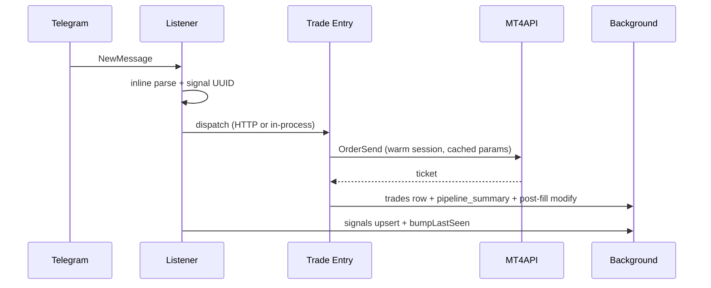

# Worker deployment (Railway / Docker)

## Hard rule: one MTProto connection per Telegram session

Telegram allows **exactly one** active connection per `telegram_sessions` auth key. Running two replicas (or overlapping deploys) with the same session causes `AUTH_KEY_DUPLICATED`, message gaps, and missed copier trades.

| Service type | Replicas | Scale lever |
|--------------|----------|-------------|
| `listener-shard-*` | **1** per shard | Add shard services (`WORKER_SHARD_ID` / `WORKER_SHARD_COUNT`) |
| `trade-worker` / `trade-entry` | 2–N | Horizontal replicas (no Telegram client) |
| `trade-mgmt` | 1–N | Management + reconcile monitors |
| `backtest-worker` | 0–2 | Bursty history sync only |
| Monolith (`WORKER_ROLE=all`) | **1** | Early commercial only |

## Railway services (recommended split)

Use the **same Docker image** with different env per service:

### 1. Listener (`WORKER_ROLE=listener`)

```env
WORKER_ROLE=listener
WORKER_SHARD_ID=0
WORKER_SHARD_COUNT=1
WORKER_INTERNAL_TOKEN=<same secret as trade workers>
TRADE_WORKER_URL=https://your-trade-entry.up.railway.app
TRADE_MGMT_WORKER_URL=https://your-trade-mgmt.up.railway.app
TELEGRAM_SHUTDOWN_DRAIN_MS=8000
WORKER_HEALTH_STALE_MS=180000
WORKER_LEASE_RENEW_INTERVAL_MS=20000
WORKER_SESSION_LEASE_TTL_MS=45000
```

- **Replicas:** min=1, max=1 (never scale this service horizontally for the same shard).
- **Health check:** `GET /health` on `WORKER_PORT` (default 8080).
- **Does not** run trade monitors or backtest sync on the live client.
- **Inline parse** in-process (default `LISTENER_INLINE_PARSE=true`); edge `parse-signal` is fallback only when inline is off. After parse, pushes to trade workers via `POST /internal/dispatch-signal` **before** background `signals` upsert (Realtime remains fallback).

### 2. Trade entry (`WORKER_ROLE=trade_entry`) — recommended for latency

```env
WORKER_ROLE=trade_entry
WORKER_REQUIRE_TELEGRAM_LIVE_FOR_TRADES=true
WORKER_INTERNAL_TOKEN=<shared secret>
```

- **Replicas:** start with **1** until you confirm no duplicate `order_send` logs per signal. With 2+ replicas, each used to subscribe to Supabase Realtime and could **double-execute** the same signal (in-memory dedupe is per process). Default: `EXECUTOR_REALTIME_SIGNALS=false` on split roles; listener push is primary, sweep is fallback.
- Executes **buy/sell** only; high-priority queue drains before management backlog.
- Monitors: virtual pending, CWE close, partial TP, signal entry pending.
- **Health:** `GET /health`; **dispatch:** `POST /internal/dispatch-signal` with `x-internal-token`.
- Startup log must show `realtime=false` on trade_entry unless you intentionally enabled it on a **single** replica.

### 3. Trade management (`WORKER_ROLE=trade_mgmt`) — optional split

```env
WORKER_ROLE=trade_mgmt
WORKER_INTERNAL_TOKEN=<shared secret>
```

- Handles **close / modify / breakeven / close worse entries**, etc.
- Monitors: basket SL/TP reconcile, auto-management, trailing stop, news filter, broker connection.

### 4. Trade combined (`WORKER_ROLE=trade`)

```env
WORKER_ROLE=trade
WORKER_REQUIRE_TELEGRAM_LIVE_FOR_TRADES=true
```

- Same as running `trade_entry` + `trade_mgmt` in one process (all monitors, all actions).
- Use when you do not want a separate management fleet yet.

### 5. Backtest (`WORKER_ROLE=backtest`)

```env
WORKER_ROLE=backtest
```

- Point Supabase Edge `BACKTEST_WORKER_URL` at this service (falls back to `WORKER_URL`).
- Ephemeral Telegram client per sync; never shares the listener connection.

### Monolith (default)

```env
WORKER_ROLE=all
```

Single replica on Railway until you split services.

## Deploy overlap

On deploy, old and new containers may briefly share an auth key. Mitigations:

1. `TELEGRAM_SHUTDOWN_DRAIN_MS=8000` (or higher) on SIGTERM before exit.
2. Railway: single replica per listener shard; avoid blue/green with two live listeners.
3. Monitor `/health` → `detail[].last_event_at` per user.

## Health endpoint

`GET /health` (no auth) returns:

- `ok` — all listeners connected and `last_event_at` within `WORKER_HEALTH_STALE_MS` (default 180s).
- `role`, `shard`, `instance`, `metrics`, `active_leases`.

Use external uptime checks on this URL for production paging.

## Sharding

Assign users with `shard = hash(user_id) % WORKER_SHARD_COUNT`. Each listener service sets `WORKER_SHARD_ID` to its index (0 … N-1).

Apply migration `20260520120000_worker_session_leases.sql` before enabling split deploys.

## Low-latency path (split deploy)

**Target:** Telegram event → broker `OrderSend` P50 **&lt;800ms**, P99 **&lt;2s** (variance from bridge round-trip only).



1. **Inline parse** — `worker/src/parseSignal.ts` + `channelKeywordsCache` (no edge HTTP on live path).
2. **Dispatch-first** — Pre-generated `signals.id`, `POST /internal/dispatch-signal` before DB writes; listener persists in background.
3. **Entry fast path** — Live `buy`/`sell` bypass queue and heavy DB idempotency (`inflight` only); `OrderSend` first, management (opposite close, merge, channel SL/TP, pip stops) in `postFillFollowUp`.
4. **Broker pre-warm** — `EXECUTOR_PREWARM_SYMBOLS` loads symbol list/params on start; `BROKER_SESSION_HEARTBEAT_MS` (default **15s**) keeps sessions warm.
5. **No market `/Quote` on live path** — Clamp from cached `SymbolParams`; pip/channel stops applied via `OrderModify` post-fill.
6. **Concurrent queue drain** — `EXECUTOR_MAX_CONCURRENT_SIGNALS` (default **4**) for sweep/realtime/management.
7. **Lease gate cache** — `WORKER_LEASE_GATE_CACHE_MS` (default **8000**).

### Diagnosing slow execution

Live entries write one consolidated row:

| `action` | Meaning |
|----------|---------|
| `pipeline_summary` | End-to-end timings (`telegram_to_listener_ms`, `parse_ms`, `dispatch_ms`, `prep_ms`, `order_send_ms`, `total_ms`) |

```sql
select
  created_at,
  request_payload->>'total_ms' as total_ms,
  request_payload->>'parse_ms' as parse_ms,
  request_payload->>'dispatch_ms' as dispatch_ms,
  request_payload->>'prep_ms' as prep_ms,
  request_payload->>'order_send_ms' as send_order_ms,
  request_payload->>'broker_send_ms' as broker_send_ms,
  request_payload->>'channel_delay_ms' as channel_delay_ms,
  request_payload->>'channel_delay_skipped' as channel_delay_skipped,
  request_payload->>'has_listener_timestamps' as has_listener_timestamps,
  request_payload->'timestamps' as timestamps
from trade_execution_logs
where signal_id = '<signal_id>'
  and action = 'pipeline_summary'
order by created_at desc
limit 1;
```

**How to read timings**

| Field | Meaning |
|-------|---------|
| `parse_ms` | Listener inline parse (`t_parse_done − t_listener_received`). `null` = trade worker never got listener stamps (redeploy listener, or signal came from sweep/realtime only). |
| `dispatch_ms` | HTTP push RTT (`t_dispatch_received − t_dispatch_sent`). |
| `prep_ms` | Trade worker before `sendOrder` (gate, keywords, broker list). |
| `order_send_ms` / `send_order_ms` | **Entire `sendOrder`** — includes channel `delay_msec`, planning, virtual-pending DB, and all leg `OrderSend` calls. |
| `broker_send_ms` | First→last broker `OrderSend` API only (after deploy with stamp fields). |
| `channel_delay_ms` | Configured Copier Engine delay; on live fast path this is **skipped** (`channel_delay_skipped: true`) so entries are not held 15s+. |

Sweep/realtime/management paths still emit `dispatch_received`, `handle_start`, `handle_end`, and per-leg `order_send` rows.

Look for `parse_ms` &gt; 100 (inline parse should stay &lt;30ms), `order_send_ms` ≈ `channel_delay_ms` (delay was blocking — fixed on live fast path), or large `prep_ms` (broker session cold — check heartbeat logs).

### Range pending legs (duplicate opens)

The worker monitor (`virtualPendingMonitor`, 1.5s) is the primary firer; **`range-pending-sweep`** (Supabase cron, ~60s) only picks up rows the worker missed for 45s+.

Guards (worker + edge sweep):

- Do not fire a `step_idx` that already has a **`fired`** row for the same `(signal_id, broker_account_id, symbol)`.
- Do not insert a new pending row for a `step_idx` that already exists (any status) — the partial unique index only blocks duplicate **active** rows, so re-plans after fire used to create a second pending rung.
- Stale `claimed` rows are reconciled (re-fire only when no `virtual_pending_fired` log exists for that leg id).
- Open trades are capped using `virtual_pending_inserted.rows` + successful `order_send` count from execution logs.

If you already have runaway duplicates, cancel orphan actives (keep one `fired` row per step):

```sql
-- Pending/claimed rows where the same step already fired
update range_pending_legs dup
set status = 'cancelled', error_message = 'manual_duplicate_cleanup'
from range_pending_legs fired
where dup.status in ('pending', 'claimed')
  and fired.status = 'fired'
  and dup.signal_id = fired.signal_id
  and dup.broker_account_id = fired.broker_account_id
  and dup.symbol = fired.symbol
  and dup.step_idx = fired.step_idx
  and dup.id <> fired.id;
```

Redeploy **Trade Entry** and **`range-pending-sweep`** after guard changes.

## Split deploy checklist (avoid duplicate trades)

| Check | Where |
|-------|--------|
| `TRADE_WORKER_URL` = **Trade Entry** public URL (https, no trailing slash) | **Listener** service only |
| `TRADE_MGMT_WORKER_URL` = **Trade Management** URL | **Listener** only |
| `WORKER_URL` is **not** used for copier execution (telegram-auth / backtest only) | Supabase Edge secrets |
| Old **`WORKER_ROLE=trade`** service is **stopped/deleted** — if it still runs, it duplicates Entry + Management | Railway |
| Trade Entry logs: `started mode=entry … realtime=false` | Trade Entry deploy logs |
| Multi-trade UI: **16 instant + 17 layering** = 16 market orders **at once** by design; only the 17 layer over time | Account config |
| `order_send` count per `signal_id` ≈ immediates; `virtual_pending_fired` ≈ layering steps | `trade_execution_logs` |

If `TRADE_WORKER_URL` points at a deleted service, push fails (listener warns `tradeSignalPush push failed`) and only sweep/realtime ran — fix the URL and redeploy listener.

## Channel management instructions (copier)

Management messages (`Close half`, `Close worse entries`, `Adjust SL`, etc.) are scoped as follows:

| Message type | Applies to |
|--------------|------------|
| **Reply** to a Telegram signal (`reply_to_message_id` set) | That signal’s basket only (e.g. Gold entry + SL/TP in the reply thread) |

**Close worse entries** (channel post) closes open legs on that channel whose entry is within your configured pip band of the live price, and always closes legs tagged with `cwe_close_price` (range multi-trade CWE immediates). Requires **Multi Trades** + **Close worse entries** enabled on the broker account. Redeploy **trade worker** and **parse-signal** after CWE fixes.

Channel **Adjust SL / TP** instructions are stored in `channel_active_trade_params` (per channel + symbol). They apply to **management**, **pending ladder legs**, and **parameter refresh** on open baskets — not to naked **buy/sell** posts with no SL/TP in the message (avoids stale levels → broker "Invalid stops"). Run migration `20260520130000_channel_active_trade_params.sql` when upgrading.

| **Channel post**, no symbol in text | All **open trades** on that Telegram channel |
| **Channel post** with symbol (`Close half on EURUSD`, `for gold`) | Open trades on that channel for that symbol only |
| **Modify SL/TP** with no symbol, multiple symbols open | Symbols where the price is plausible; if none match, the **most recently opened** symbol on the channel |

**Virtual range pendings** (`range_pending_legs`): management applies to pending ladder legs too — **Adjust SL/TP** updates their `stoploss` / `takeprofit` before they fire; **Close** deletes all pending legs in scope so they cannot trigger later.

Deploy **Trade worker** after logic changes; deploy **`parse-signal`** Edge if symbol parsing (`on` / `for`) changed.

## Telegram session persistence (one login)

TScopier stores a GramJS **StringSession** in `telegram_sessions.session_string` after you verify your phone once. The **listener worker** holds a single long-lived MTProto socket and persists session rotations every ~30 minutes. The UI never opens its own Telegram connection.

### my.telegram.org — Test vs Production

| Field | Purpose |
|-------|---------|
| **Production configuration** | Real `api_id` + `api_hash` for live Telegram. **Use these** in `TELEGRAM_API_ID` / `TELEGRAM_API_HASH` on the listener worker. |
| **Test configuration** | Separate credentials for Telegram’s **test DCs** (fake users, not production traffic). Do **not** use for TSCopier. |
| **DC 2 IP addresses** | Telegram datacenter server IPs. The MTProto client picks the correct DC automatically; you do not configure these in env. |
| **Public Key** | Telegram server RSA key used during MTProto encryption handshake. Handled internally by GramJS — not an env var. |

### What disconnects a session (and what does not)

| Event | Result |
|-------|--------|
| User clicks **Disconnect** on Copier Engine | Session row deleted; **configured channels kept** |
| Transient worker/network error | Watchdog reconnects; session **not** cleared |
| `AUTH_KEY_DUPLICATED` | Two workers connected with the same session — fix replicas; listener retries |
| `AUTH_KEY_UNREGISTERED` | Telegram revoked the key (rare); session row removed; **channels kept**; user re-verifies phone |
| Supabase/worker 401 (misconfigured token) | Error shown; session **not** auto-deleted |

**Never run more than one listener replica per shard** with the same user session. See `WORKER_LEASE_*` and `docs/worker-deployment.md` hard rule above.

## Environment reference

See `worker/.env.example` for catch-up, lease, and parse tuning variables.
